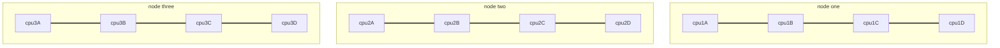
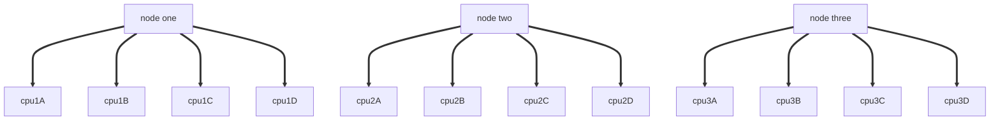
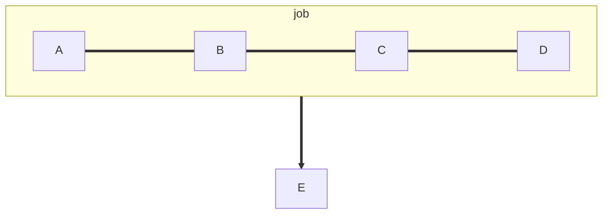
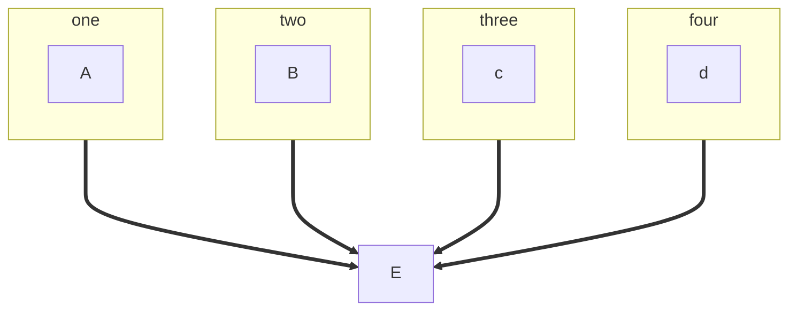

[toc]

# DataLab Collaboratory - slurm, srun, and sbatch - June 2023

[Go back to main schedule page](https://hackmd.io/KhkZGZhyRt6pu4lbEHi6ow?view)

Edit on [](https://hackmd.io/9XoHaRy3RFyoEpSIaGqyBw) or on [](https://github.com/ngs-docs/2023-june-datalab-collaboratory/blob/main/resources/slurm-srun-sbatch-clusters.md)

## possible TODO items for collaboratory

* write out an srun command for running some of your software
    * add it to your README.md file (which is in git, right?)
* write an sbatch file for running some of your software
    * test it, and then add that sbatch file into git!
* add benchmarking information to your sbatch file so that you measure resource utilization for one or all of your commands! (and then adjust your requirements...)
    * `/usr/bin/time -v` in front of a command;
    * `scontrol show job ${SLURM_JOB_ID}` in an srun/sbatch session - have it be the last command run.
    * a shorter, neater version that just displays memory usage: `sstat --format 'JobID,MaxRSS' -j ${SLURM_JOB_ID}`

## srun vs sbatch

srun runs interactively. That means if your Internet connection drops, your job dies.

It's also hard to run/organize many sruns at the same time.

sbatch does not run interactively! And you can run many of them at the same time.

## srun commands must:
* srun commands describe necessary compute resources: time, memory, CPUs, queue. e.g.,
    * ```srun -p high2 --time=3:00:00 --nodes=1 --cpus-per-task 4 --mem 10GB --pty /bin/bash```

## sbatch scripts must:
* contain description of necessary compute resources: time, memory, CPUs, queue
* load necessary software via modules, conda, etc.

## sbatch scripts should:
* contain commands to measure resources actually used
* log output

## sbatch scripts can:

* notify you when things are done - 
* be in version control
* be parameterized!!

## Session notes

(add notes here, everyone!)

`tmux`/`screen` are options to keep a `srun` command persistant.

HPC partitions do have time limit (medium and high priority 150 days, but low priority has only 4 hrs)

Q: What is the difference between tasks, cpus, nodes?
> __From: https://github.com/dib-lab/farm-notes/blob/latest/advanced-usage.md__
> 
> In general, a lot of what us bioinformaticians run is NOT cluster-aware, so unless you have other information that something is slurm- or cluster- adapted, you probably want to use -N 1 -n 1 and only adjust -c.
>
> For example, if I am running snakemake on a single node and want it to be able to run 32 jobs at the same time, I would set -c 32 in the slurm sbatch script, and tell snakemake to use -j 32. Similar logic applies to any multithreaded application that is not cluster aware: -c corresponds to number of threads to use.
>
> Thus spake @luizirber:
>
>    `--ntasks` makes sense for MPI (or things that are closely tied when running), which shouldn't be the case for us.
>
> Here is an additional comment from the `--cpus-per-task` documentation:
>
>    For instance, consider an application that has 4 tasks, each requiring 3 processors. If our cluster is comprised of quad-processors nodes and we simply ask for 12 processors, the controller might give us only 3 nodes. However, by using the --cpus-per-task=3 options, the controller knows that each task requires 3 processors on the same node, and the controller will grant an allocation of 4 nodes, one for each of the 4 tasks.
>





> Q: I have 4 jobs, I want to know if I should go 4 separate scripts or one script of 4 or 1 script of 4 parallel

[A brief overview of automation and parallelization options in UNIX/on an HPC](https://hackmd.io/E8EgmtZoSe-lou4ZJnpiFw?view)






may use `module load conda` instead of `. ~/mambaforge/etc/profile.d/conda.sh` in your sbatch script

#### Benchmarking: To know how many resources to give a job
- `/usr/bin/time -v ls` 
- snakemake benchmarks 
- sbatch script logs
- py-spy

## Documentation and tutorials and other resources

(add your favorites here!)

Introductory:
* [Executing large analyses on HPC clusters with slurm](https://ngs-docs.github.io/2021-august-remote-computing/executing-large-analyses-on-hpc-clusters-with-slurm.html)

Reference:
* [How do srun and sbatch differ?](https://servicehub.ucdavis.edu/servicehub?id=ucd_kb_article&sys_id=c0d15dd3db21a41032447d71ba961917)

## Appendix: example sbatch files

### A basic sbatch file

Setting time, memory, CPUs, and partition/queue:
```
#! /bin/bash
#
#SBATCH -c 1                                    # NUMBER OF PROCESSORS PER TASK
#SBATCH --mem=1Gb                               # MEMORY POOL TO ALL CORES
#SBATCH --time=00-00:05:00                      # REQUESTED WALL TIME
#SBATCH -p high2                                # PARTITION TO SUBMIT TO

echo Hello World
sleep 15
date
```
(you may need to modify partition depending on what system you are using.)

### Adding custom job name, output files, and e-mail notifications

You'll want to change the e-mail notification address ;).

```
#! /bin/bash
#
#SBATCH --mail-user=<email>@ucdavis.edu         # YOUR EMAIL ADDRESS
#SBATCH --mail-type=ALL                         # NOTIFICATIONS OF SLURM JOB STATUS - ALL, NONE, BEGIN, END, FAIL, REQUEUE
#SBATCH -J HelloWorld                           # JOB ID
#SBATCH -e HelloWorld.j%j.err                   # STANDARD ERROR FILE TO WRITE TO
#SBATCH -o HelloWorld.j%j.out                   # STANDARD OUTPUT FILE TO WRITE TO
#SBATCH -c 1                                    # NUMBER OF PROCESSORS PER TASK
#SBATCH --mem=1Gb                               # MEMORY POOL TO ALL CORES
#SBATCH --time=00-00:05:00                      # REQUESTED WALL TIME
#SBATCH -p high2                                # PARTITION TO SUBMIT TO

echo Hello World
sleep 15
date
```

### sbatch file for loading a conda environment

Remember to change the e-mail!
```
#!/bin/bash -login
#SBATCH -p med2                # use 'med2' partition for medium priority
#SBATCH -J myjob               # name for job
#SBATCH -c 1                   # 1 core
#SBATCH -t 1:00:00             # ask for an hour, max
#SBATCH --mem=2000             # memory (2000 mb = 2gb)
#SBATCH --mail-type=ALL
#SBATCH --mail-user=<email>@ucdavis.edu

# initialize conda
. ~/mambaforge/etc/profile.d/conda.sh

# activate your desired conda environment
conda activate base

# fail on weird errors
set -e
set -x

### YOUR COMMANDS GO HERE ###
# for example,
sleep 15
### YOUR COMMANDS GO HERE ###

# Print out values of the current jobs SLURM environment variables
env | grep SLURM

# Print out final statistics about resource use before job exits
scontrol show job ${SLURM_JOB_ID}

sstat --format 'JobID,MaxRSS,AveCPU' -j ${SLURM_JOB_ID}
```

## Parameterizing sbatch

```
#! /bin/bash
#
#SBATCH -c 1                                    # NUMBER OF PROCESSORS PER TASK
#SBATCH --mem=1Gb                               # MEMORY POOL TO ALL CORES
#SBATCH --time=00-00:05:00                      # REQUESTED WALL TIME
#SBATCH -p high2                                # PARTITION TO SUBMIT TO

echo Hello World $1
sleep 15
date
```


Submit this with `sbatch foo`.
